# James Boland Portfolio website 

### [See the live version](https://dotslashjb.netlify.app)

### [See the repo](https://github.com/JRBoland/portfolio)

### See the presentation video


## Purpose

Purpose of this site is to be able to introduce myself and showcase my skills and interests as a developer to potential employers or clients. There is a further intention to update the site with real projects that I have worked on over time, allowing the client or employer to easily see examples of my previous work. 

Working as a modern 'digital business card' or much like a digital CV, an online portfolio website allows people to be familiar with the work that I do, and have options to contact me (with the added benefit of seeing my previous work) for the purpose of being hired for new work.

## Functionality

On initially loading the website, the main/index page has animations to capture the attention of its users.

The site is composed of four main pages, with additional blog (projects) pages. The user can freely navigate through the four main pages with the nav bar. Clicking the ***./JB*** icon leads the user to the home page and restarts the animation. 

The blog posts, accessed through the projects page, has options to navigate between blog posts and back to projects the projects page.

## Features

- Each link has an opacity hover animation and an additional italicized on click animation.

- **Main/Index page**
    - Contains a welcome message and a call to action button with its own unique hover animation that links to ***about***.
    - Contains animations on all elements.
- **About page**
    - Has the sub headings *about*, *education*, *approach*, and *skills* each with their own paragraph.
    - The skills sub heading contains a list of languages I am in the process of learning, and languages I will be learning in the not-so-distant future (during this course).
    - Includes ```keyframe``` animations on some of the sub heading icons.
    - Has an image of me, which is fixed so it can stay in the same position when the user is scrolling on desktop and tablet view. On mobile view the image is at the bottom of the page.
    - Has a link to download my resume.
- **Projects (blog) page**
    - Contains links to various blog posts, with images, dates and a short descriptor.
- **Contact page**
    - Contains social media and contact links and a textarea message form for the user to leave me a message.

- **Blog posts**
    - The blog posts include a blog post image, date published, icons, and navigation links between the different blog post pages and the projects page

    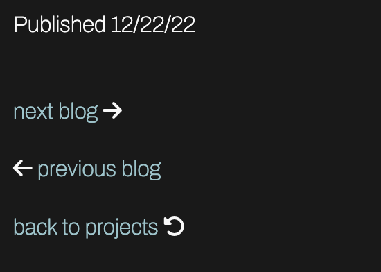

The first and last blog posts have different navigation link options depending on which post you are on. The first post does not have the option to view the previous post, and the last post does not have the option to view the next post.

Each page of the website also includes a **header** and **footer** section.

The header section contains:
- A **nav bar** with access to the ***about***, ***projects***, and ***contact page***.
- An icon which acts as a home directory navigation. Clicking this icon will lead you back to the same page that you are greeted with when initially loading the site, animations and all.
- A 'current place' indicator under the icon, denoted by a forward slash (/) and then the current page. eg. /home on index.html. The purpose of this is to mimic a directory, eg. ./JB/home or ./JB/about on the about page.

   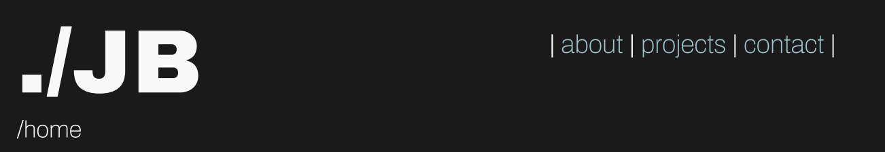

The footer section contains:
- Quick contact links (call, email)
- Social media icon links
- Copyright detail

The footer is styled differently for mobile view vs desktop & tablet view.

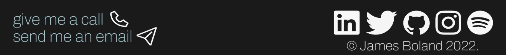
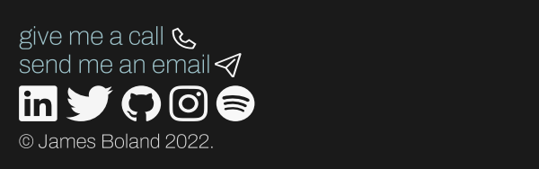

## Target audience

The target audience is anyone that I wish to work with, or that may wish to work with me. It is intended to be for potential employers, or clients. 

It is also intended to help in networking, as it is greatly beneficial to have an online website or portfolio to show to other developers.


## Tech Stack

- HTML5
- CSS3
- Figma
- Github
- Netlify

## Screenshots
### Desktop View


### Tablet view
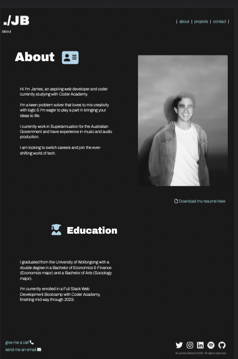

### Mobile view
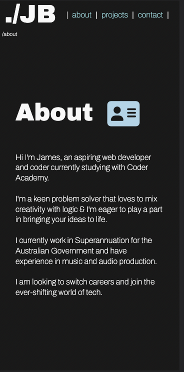
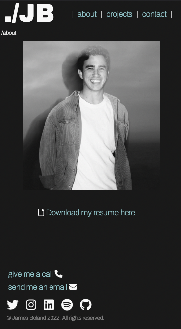
- *Showing both the top and the bottom of the about page.*


## Sitemap
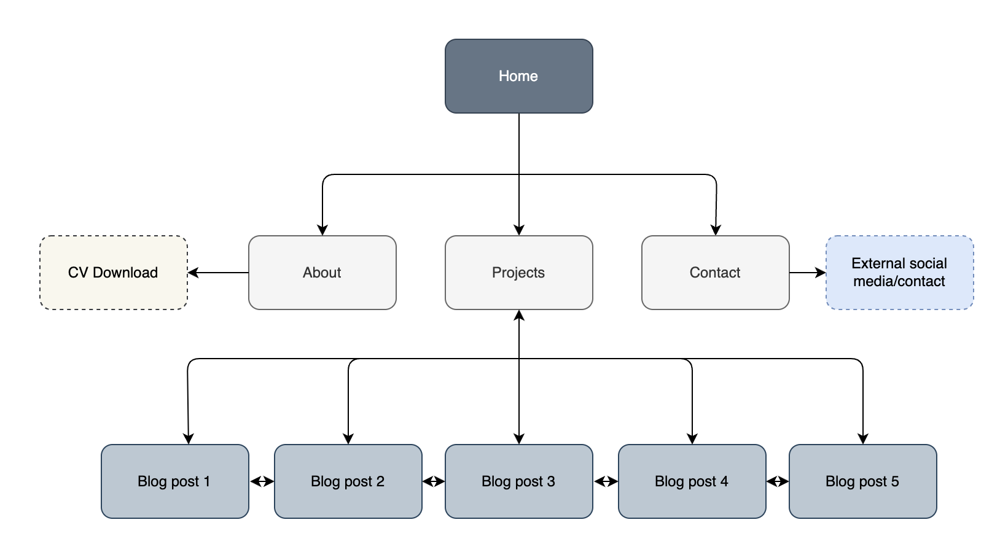


## Desktop view mockups
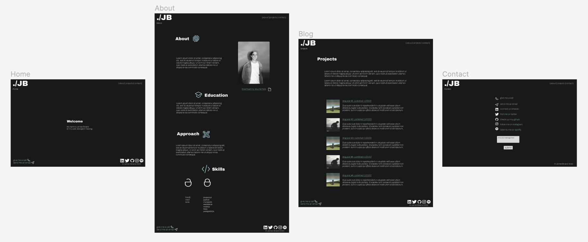
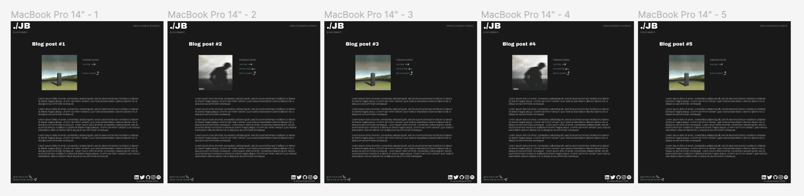

## Tablet view mockups
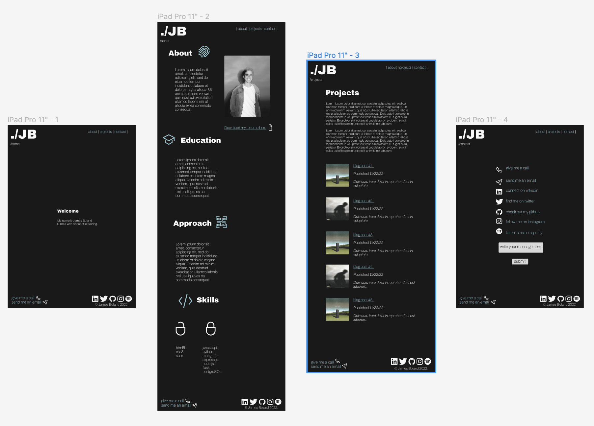
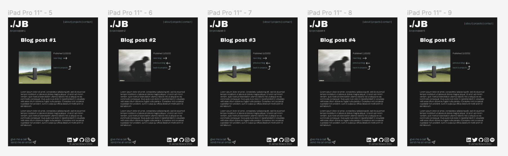

- *Note the image on the about page is fixed and will sit in place whilst scrolling on tablet and desktop view.*


## Mobile view mockups
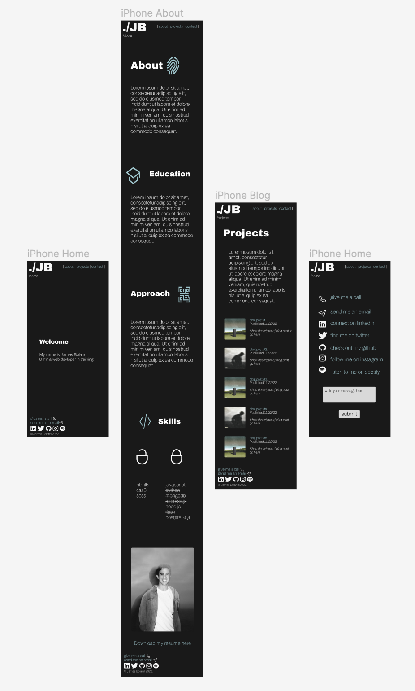
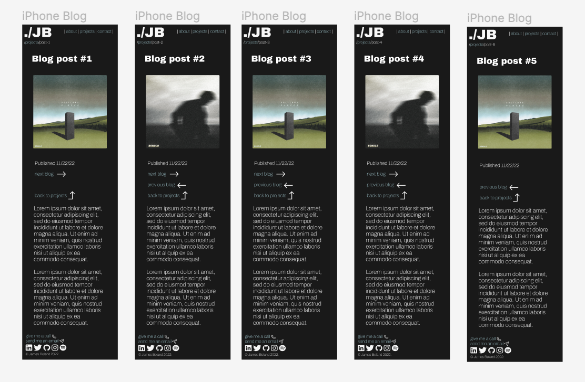


### References

*typewriter CSS was made with help from [this video](https://www.youtube.com/watch?v=w1nhwUGsG6M&ab_channel=KevinPowell)*

*photo blog-image-4.png from Francesco Ungaro on [pexels.com](https://www.pexels.com/photo/close-up-photo-of-brown-seaweeds-3640403/)*

*Sitemap created with [draw.io](https://draw.io)*

*All other images on the site are my own*